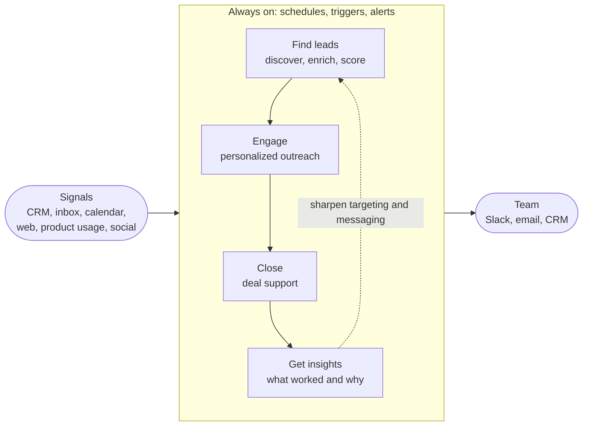

# GTM Engine

An always-on engine for go-to-market: find the right leads, engage customers and the market, close more deals, and learn from every interaction.

> **Status:** early and exploratory. Expect fast iteration, rough edges, and frequent rewrites.

## What this is

This repo is where we experiment with GTM applications. Each experiment is a small, focused app that tackles one part of the funnel. The ones that prove their value graduate into the engine itself: a connected set of agents and workflows that run continuously, watching for signals and acting on them instead of waiting for someone to open a tool.

## Goals

| Goal | What it means | How we might measure it |
| --- | --- | --- |
| **Find leads** | Discover and prioritize the accounts and people most likely to buy. | Qualified leads per week, ICP fit of new pipeline |
| **Engage** | Reach customers and the market with relevant, timely, personal touches, at scale. | Reply rate, meetings booked |
| **Close** | Move deals forward faster, with fewer surprises. | Win rate, sales cycle length, slipped deals |
| **Get insights** | Know what is working, what is not, and why. | Forecast accuracy, time to answer a GTM question |
| **Always on** | Watch for signals and act, or alert a human, without being asked. | Time from signal to action, share of work handled automatically |

## How it fits together

The engine is a loop. Signals come in; the engine finds and prioritizes who to talk to, helps engage them, supports each deal through to close, and feeds what it learns back into targeting and messaging.



Every app builds on a shared foundation:

- **Connectors:** read from and write to the tools the team already uses, such as the CRM, email, calendar, Slack, docs, enrichment providers, and the web.
- **Data:** one shared model of accounts, contacts, interactions, and signals, so every app sees the same picture.
- **Intelligence:** LLM-powered research, scoring, classification, drafting, and summarization.
- **Runtime:** schedules, event triggers, and queues that keep the engine running without anyone pressing a button.
- **Delivery:** results land where people already work, with a human approval step for anything customer-facing.

## Experiment ideas

A starting backlog, grouped by goal. Not a commitment; a menu to pick from.

### Find leads

- **ICP scoring:** learn what great customers have in common from closed-won deals, then score every account against it.
- **Signal-based prospecting:** surface accounts showing buying signals such as funding, hiring, leadership changes, new tech, or product launches.
- **Lookalikes:** find more companies like our best customers.
- **Enrichment pipeline:** fill in firmographics and contacts, deduplicated against the CRM.
- **Inbound research:** research every new sign-up or form fill the moment it arrives, and route it to the right person.

### Engage

- **Personalized first touch:** research-backed email and LinkedIn drafts, reviewed before sending.
- **Reply triage:** classify replies (interested, objection, not now, unsubscribe, out of office) and suggest the next step.
- **Follow-up keeper:** make sure no promising thread goes cold.
- **Meeting prep briefs:** attendees, their priorities, and our full history with the account, ready before every call.
- **Content engine:** turn calls, wins, and posts into outreach snippets and social content.
- **Market listening:** track mentions, competitor moves, and conversations worth joining.

### Close

- **Call notes to CRM:** summaries, next steps, and field updates written back automatically.
- **Deal risk radar:** flag stalled threads, missing stakeholders, and slipping close dates.
- **Proposal drafting:** first drafts of proposals, quotes, and follow-ups from deal context.
- **Objection playbook:** a living library of objections and answers mined from real conversations.
- **Mutual action plans:** shared next steps and stakeholder maps for every active deal.

### Get insights

- **Pipeline snapshot:** health, coverage, and forecast at a glance.
- **Win/loss analysis:** patterns across calls, emails, and CRM notes.
- **Competitive intel:** track competitor pricing, positioning, and launches.
- **Weekly GTM digest:** what changed, what needs attention, what worked.
- **Ask the engine:** plain-language questions over GTM data, such as "which accounts went quiet this month?"

### Always on

- **Daily brief:** the accounts to act on today, and why.
- **Event triggers:** react to new sign-ups, replies, stage changes, and champions changing jobs.
- **Smart alerts:** Slack or email notifications that come with a suggested action.
- **CRM hygiene:** fill missing fields, log activity, and flag duplicates continuously.

## Experiments

One place to see what exists and where it stands. Add a row when you start an experiment, and keep its status current.

| Experiment | Goal | Status | What it does |
| --- | --- | --- | --- |
| [Radar](apps/radar) | Find leads, Get insights, Always on | prototype | Morning brief on AI liability insurance, traced to the original sources and the people behind them |

### Lifecycle

`idea` → `prototype` → `pilot` → `live`, or `retired` at any stage.

| Stage | Bar to reach it |
| --- | --- |
| `idea` | A hypothesis, the goal it serves, and a success metric. |
| `prototype` | Works end to end on sample data or a handful of real records. |
| `pilot` | Runs on real data, with a human reviewing every output. |
| `live` | Runs on a schedule or trigger, is monitored, and has an owner. It is now part of the always-on engine. |
| `retired` | Stopped, with learnings written down so nobody repeats it blind. |

### Experiment README template

Each experiment lives in `apps/<experiment-name>/` with a README like this:

<details>
<summary>Show template</summary>

```markdown
# Experiment name

- **Goal:** Find leads | Engage | Close | Get insights | Always on
- **Status:** idea | prototype | pilot | live | retired
- **Owner:**

## Hypothesis
What we believe, and why.

## Success metric
How we will know it worked, with a target.

## Inputs and outputs
Data it reads, actions it takes, and where results land.

## How to run
Setup, required environment variables, and commands.

## Learnings
What worked, what did not, and what comes next.
```

</details>

## Principles

- **Start small.** Build the smallest thing that can prove the idea. Harden only what earns it.
- **Every experiment has a number.** Name the metric before building; record the result after.
- **Humans approve what customers see.** Start with drafts and suggestions. Automate a step only once its output is reliably good.
- **Meet the team where they work.** Slack, email, the CRM, the calendar. A new dashboard is the last resort.
- **Build once, reuse everywhere.** When a second app needs the same connector, prompt, or scoring logic, move it to `shared/`.
- **Leave a trail.** Log every automated action with what happened, when, and why.
- **Play fair.** Honor consent and anti-spam rules (such as CAN-SPAM and GDPR), data provider terms, and rate limits.

## Repository layout

Planned structure; it will evolve as experiments land.

```text
gtm-engine/
├── apps/       # One folder per experiment or application
├── shared/     # Reusable building blocks: connectors, data models, prompts, scoring
├── docs/       # Decisions, playbooks, and experiment write-ups
└── README.md
```

Languages and tools are chosen per experiment for now. We will standardize once patterns emerge.

## Working in this repo

1. Branch from `main` with a conventional prefix: `feat/`, `fix/`, `chore/`, `docs/`, or `refactor/`.
2. Create `apps/<experiment-name>/` with a README based on the [template](#experiment-readme-template).
3. Add the experiment to the [Experiments](#experiments) table.
4. Keep credentials in environment variables or a local `.env` file that is never committed, and list the required variables in the app's README.
5. Open a pull request that states the hypothesis and how you will measure it.
